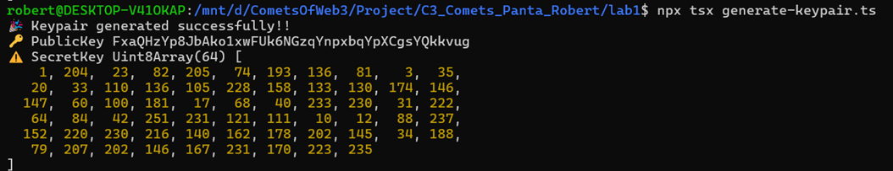
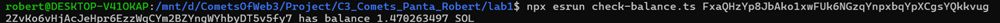
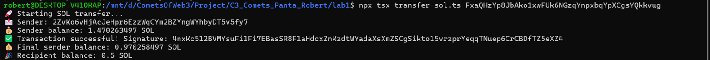

# Laboratory 1
# Solana Transaction Scripts

This repository contains TypeScript scripts to interact with the Solana blockchain, including generating keypairs, checking balances, and sending SOL between accounts.

## Commands

### 1. Generate Keypair

Use this command to generate a new Solana keypair and save it to a specified file.

```bash
npx tsx generate-keypair.ts
```

<p align="center">
  
  <br>
  <em>Ex1: Generate Keypair</em>
</p>

### 2. Check Balance

This command checks the balance of a Solana account by providing its public key.

```bash
npx esrun check-balance.ts <public-key>
```

Replace public-key with the actual public key of the Solana account.

<p align="center">
  
  <br>
  <em>Ex2: Check Balance</em>
</p>

### 3. Send SOL

This command sends SOL from one account to another. To complete the transfer, provide the recipient's public key.

```bash
npx tsx transfer-sol.ts <recipient-public-key>
```

Replace recipient-public-key with the actual public key of the recipient's Solana account.

<p align="center">
  
  <br>
  <em>Ex3: Send SOL</em>
</p>
