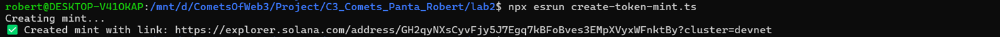
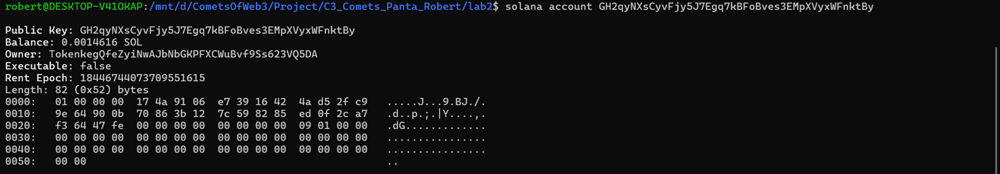
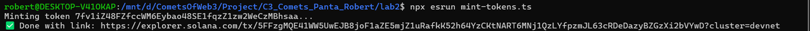
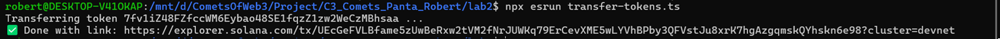

# Laboratory 2
# Solana Transaction Scripts

This repository contains TypeScript scripts to interact with the Solana blockchain, including creating token mints, minting tokens, and transferring tokens.

## Commands

### 1. Create Token Mint

Use this command to create a new token mint on the Solana blockchain.

```bash
npx esrun create-token-mint.ts
```
This script initializes a new SPL token mint and returns an explorer link to verify the mint.

<p align="center">
  
  <br>
  <em>Ex1: Create Token Mint</em>
</p>

```bash
solana account <new-address>
```

<p align="center">
  
  <br>
  <em>Ex1.1: Check Token Details</em>
</p>


### 2. Mint Tokens

This command mints additional tokens to an associated token account.

```bash
npx esrun mint-tokens.ts
```

<p align="center">
  
  <br>
  <em>Ex2: Mint Tokens</em>
</p>

### 3. Transfer Tokens

This command transfers SPL tokens from one account to another. Ensure that the recipient has an associated token account.

```bash
npx esrun transfer-tokens.ts
```

<p align="center">
  
  <br>
  <em>Ex3: Transfer Tokens</em>
</p>

```bash
spl-token display <token-address>
```

<p align="center">
  
  <br>
  <em>Ex3.1: Check SPL Token Details</em>
</p>

