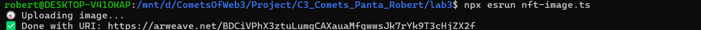
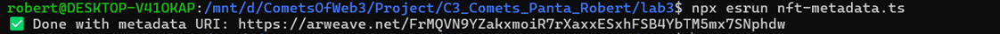
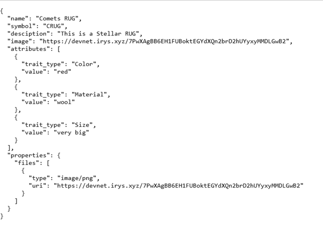
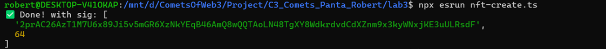
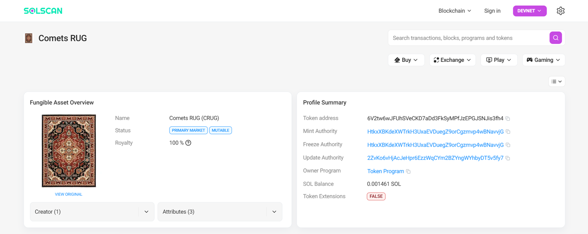

# Laboratory 3
# Solana Transaction Scripts

This repository contains TypeScript scripts to interact with the Solana blockchain, including uploading NFT images, NFT metadata and creating NFTs.

## Commands

### 1. Upload NFT Image

Use this command to upload an image to be used for an NFT.

```bash
npx esrun nft-image.ts
```
This script uploads an image and returns a URI to access it.

<p align="center">
  
  <br>
  <em>Ex1: Upload NFT Image</em>
</p>

### 2. Upload NFT Metadata

This command uploads metadata for an NFT, including name, symbol, description, and attributes.

```bash
npx esrun nft-metadata.ts
```

This script generates metadata in JSON format and uploads it to a decentralized storage service, returning a metadata URI.

<p align="center">
  
  <br>
  <em>Ex2: Upload NFT Metadata</em>
</p>

Checking <https://devnet.irys.xyz/FrMQVN9YZakxmoiR7rXaxxESxhFSB4YbTM5mx7SNphdw> for NFT Metadata.

<p align="center">
  
  <br>
  <em>Ex2.1: Check for NFT Metadata</em>
</p>

### 3. Create NFT

This command mints a new NFT on the Solana blockchain using the uploaded metadata.

```bash
npx esrun nft-create.ts
```

This script initializes a new NFT mint, assigns metadata, and confirms the transaction on the blockchain.

<p align="center">
  
  <br>
  <em>Ex3: Create NFT</em>
</p>

Checking <https://solscan.io/tx/2prAC26AzT1M7U6x89Ji5v5mGR6XzNkYEqB46AmQ8wQQTAoLN48TgXY8WdkrdvdCdXZnm9x3kyWNxjKE3uULRsdF?cluster=devnet> and Mint for NFT Details.

<p align="center">
  
  <br>
  <em>Ex3.1: NFT Details</em>
</p>